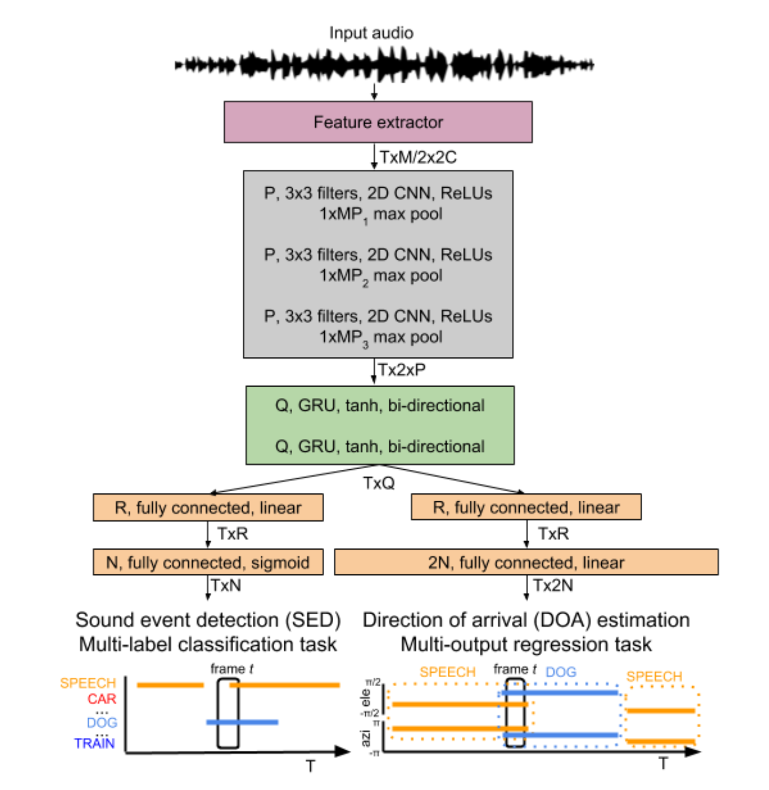
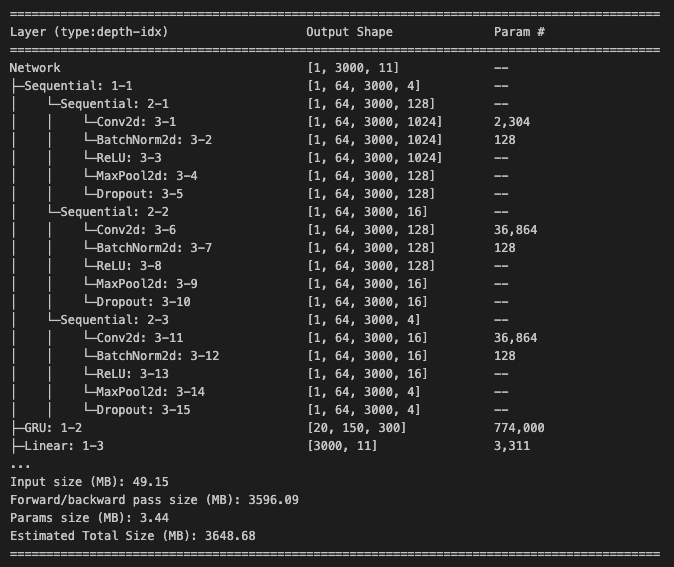
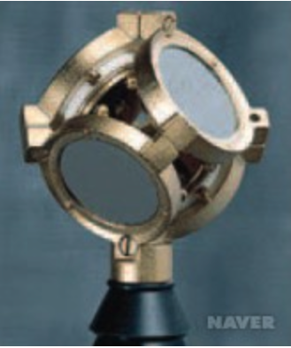
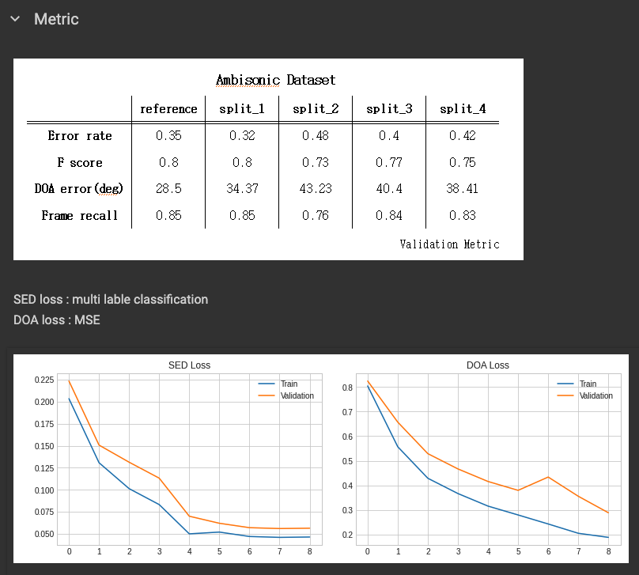
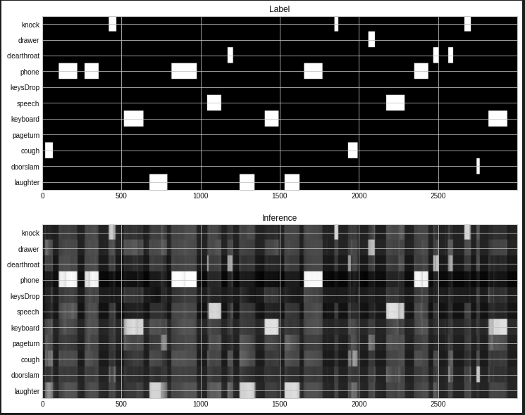
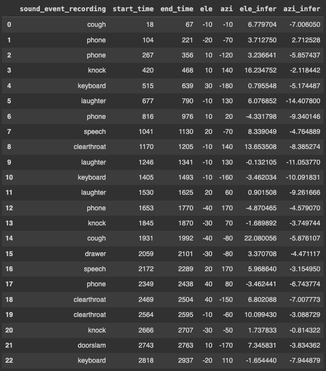

# Sound-Event-Localization-and-Detection

## 주제

음향 데이터에서 음원의 위치를 추적하고 종류를 예측하는 모델을 설계한다.

## Model 

## Dataset

_Data Description_  
 - 48000Hz로 샘플링한 1분 길이의 오디오
 - 4 채널을 통해 녹음하였다. (Quadraphonic)  
 - 11가지의 클래스를 가진다.
 - 사실적인 녹음을 위해 주변 소음을 합성하여 평균 SNR이 30dB이 되도록 한다.
 - 소리의 종류와 소리의 발생 위치를 Label로 한다. 이 때, 발생 위치는 구좌표계를 사용한다.
___데이터 수집___  

_dist(distance), 거리_  
_ele(elevation), 고도_  
_azi(azimuth), 방위각_  
 - Eigenmike에서 1m 떨어진 거리에서 10° 간격으로 -40° ~ 40°, 총 9개의 고도에 대해 10° 방위각 36개의 IR(Impulse Response)로 324개의 개별 DOA 생성  
 - Eigenmike에서 2m 떨어진 거리에서 10° 간격으로 -20° ~ 20°, 총 5개의 고도에 대해 10° 방위각 36개의 IR로 180개의 개별 DOA 생성  

image

_데이터의 수집은 서로 다른 5개의 실내 위치에서 수집되었다._
 - Language Center: 여러 개의 좌석 테이블과 카펫 바닥이 있는 넓은 공용 공간. 사람들이 대화하며 일하고 있음.  
 - Reaktori Building: 여러 개의 좌석 테이블과 카페 바닥이 있는 대형 카페테리아. 사람들이 대화하며 음식을 먹고 있음.  
 - Festia Building: 단단한 바닥이 있는 높은 천장 복도. 사람들이 돌아다니며 대화하고 있음.  
 - Tietotalo Building: 주변에 교실이 있고 단단한 바닥이 있는 복도. 사람들이 돌아다니며 대화하고 있음.  
 - Sahkotalo Building: 여러 개의 소파와 테이블이 있는 넓은 복도. 서로 다른 부분의 단단한 카펫 바닥. 사람들이 돌아다니며 대화하고 있음.
_Ambisonic microphone_

## Metric

## 결과

- 현재는 구동되지 않는 keras_model.py, SELD.py를 최신버전으로 수정하였다.
- keras로 중심으로 작성된 프로젝트를 pytorch로 재표현하여 전체 script를 경량화하였다.
- 오디오 파일을 분석할 때, STFT을 사용해서 frame별 FFT를 이용하고 해석할 수 있다.
- CNN - RNN을 통해 시간 - 주파수 이미지의 특징을 추출하고 순환 신경망을 이용해 시계열 데이터를 해석할 수 있다.
- 오디오 데이터셋(multi label, multi class) 과제에서 적절한 loss function과 optimizer를 통해 학습하고 이를 시각화 할 수 있다.
- F1-score와 Error-rate를 통해 학습된 결과를 검증할 수 있다.
